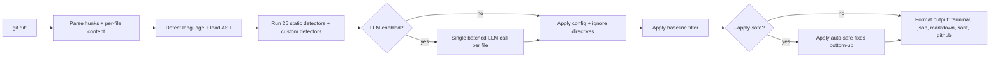

# agent-review

> Catch the 35 specific bugs AI coding agents commit when they write or modify code. Offline by default. Free. MIT.

[](https://www.npmjs.com/package/@vnmoorthy/agent-review)
[](LICENSE)
[](https://nodejs.org)
[](./test)
[](./TAXONOMY.md)

```bash
npx @vnmoorthy/agent-review                 # review staged changes
npx @vnmoorthy/agent-review --last-commit   # review HEAD~1..HEAD
npx @vnmoorthy/agent-review --working-tree  # review uncommitted edits
npx @vnmoorthy/agent-review --apply-safe    # auto-fix the high-confidence ones
```

```
$ npx @vnmoorthy/agent-review

agent-review: 6 findings
  ! high 1   * medium 3   - low 2
  hallucination (1)   dead-code (2)   drive-by (2)   safety (1)

src/auth.ts
  ! high   AR017  Silent or swallowed catch  (high)
    src/auth.ts:42  Catch block silently swallows the error.
      try { verify(token) } catch (e) { /* swallow */ }
    suggestion: Re-throw, surface to the caller, or annotate why it's intentionally ignored.

  - low    AR002  Unused imports  (high)
    src/auth.ts:3   Import `useMemo` is not used in this file.
    suggestion: remove lines 3-3
```

## Why agent-review

AI coding agents have a different bug profile than humans. Three structural differences drive a [taxonomy of 35 patterns](./TAXONOMY.md) you'll see Claude Code, Codex, Cursor, OpenHands, and Aider repeat in production:

- **Agents over-build.** Dead code, phantom types, orphaned files.
- **Agents pattern-match across languages.** `array.contains()` in JS, `len.x()` in Python, `unwrap_or_panic()` in Rust — none of these exist.
- **Agents focus on the happy path.** Edge cases, error paths, and contract drift escape the loop.

Generic linters were designed for human bugs. Hosted AI reviewers cost $24–$30/dev/month and make every diff round-trip to a model. **agent-review is the layer between them**: free, offline, deterministic for 25 of the 35 patterns; opt-in LLM for the remaining 10 fuzzier ones.

## How agent-review compares

| Tool | Targets agent-specific bugs | Static (offline) | LLM-augmented | Inline `.disable` directives | SARIF / Code Scanning | Custom rules | Drop-in skill | License | $ / dev / mo |
|------|:---:|:---:|:---:|:---:|:---:|:---:|:---:|:---:|:---:|
| **agent-review** | **Yes (35-mode taxonomy)** | **Yes** | **Optional** | **Yes** | **Yes** | **Yes** | **Yes (Claude Code)** | **MIT** | **$0** |
| CodeRabbit | Generic | No | Yes | Limited | Limited | Limited | No | Closed | $24 |
| Greptile | Generic | No | Yes | No | Limited | Yes | No | Closed | $30 |
| Bito | Generic | No | Yes | No | No | Limited | No | Closed | $15 |
| Ellipsis | Generic | No | Yes | No | No | Limited | No | Closed | Custom |
| ESLint / Pylint | None | Yes | No | Yes | Plugin | Plugins | No | OSS | $0 |
| Semgrep OSS | None | Yes | No | Yes | Yes | Yes | No | OSS | $0 |
| **Caveman skill** | None (token saver) | n/a | n/a | n/a | n/a | n/a | Yes | OSS | $0 |

agent-review is the only tool that ships a curated taxonomy of *agent-specific* failure modes, runs offline by default, and drops into Claude Code as a skill that self-reviews every diff before declaring "done".

## Install

```bash
# Run with no install
npx @vnmoorthy/agent-review

# Install globally
npm i -g @vnmoorthy/agent-review

# Or as a dev dependency
npm i -D @vnmoorthy/agent-review
```

Node 18+ required.

## Use as a Claude Code skill

```bash
npx @vnmoorthy/agent-review skill install
```

Installs `~/.claude/skills/agent-review/`. From this point on, when you wrap up a coding task in Claude Code, the skill triggers, runs `agent-review --json` against your diff, and reports findings before declaring "done". Uninstall with `npx @vnmoorthy/agent-review skill uninstall`.

## Use as a git pre-commit hook

```bash
npx @vnmoorthy/agent-review hook install
```

Installs `.git/hooks/pre-commit` to run `agent-review --staged --fail-on high`. Blocks commits with `high` or `critical` findings; otherwise stays quiet.

## One-shot bootstrap

```bash
npx @vnmoorthy/agent-review init
```

Drops a starter `.agent-review.json`, installs the pre-commit hook, installs the Claude Code skill — all in one step. Pass `--skip-hook`, `--skip-skill`, or `--skip-config` if you want partial setup.

## Look up a finding

```bash
npx @vnmoorthy/agent-review explain AR017
```

Prints the taxonomy entry for any detector ID — handy when reading a finding in a CI log and you want the full context without leaving the terminal.

## Use in CI

The repo ships a [composite GitHub Action](./action.yml) that runs the review, posts inline annotations on the PR diff, uploads a SARIF file to GitHub Code Scanning, and (optionally) leaves a markdown comment on the PR.

```yaml
name: agent-review
on:
  pull_request:
    types: [opened, synchronize, reopened]
permissions:
  contents: read
  pull-requests: write
  security-events: write
jobs:
  review:
    runs-on: ubuntu-latest
    steps:
      - uses: actions/checkout@v4
        with: { fetch-depth: 0 }
      - uses: vnmoorthy/agent-review@v0
        with:
          fail-on: high
          # llm: "true"
          # anthropic-api-key: ${{ secrets.ANTHROPIC_API_KEY }}
```

## Modes

### Static (default)

Deterministic detectors that run against the AST + diff. No API key, no network, no LLM call. Catches 25 of the 35 failure modes (AR001–AR025).

### LLM-augmented

10 fuzzier detectors (AR026–AR035) that catch subtle logic errors, spec drift, missing edge cases, fabricated citations. Pick the provider you already have a key for:

```bash
# Anthropic (Claude Haiku 4.5 by default — recommended)
ANTHROPIC_API_KEY=sk-ant-... npx @vnmoorthy/agent-review --llm

# OpenAI / OpenAI-compatible (Groq, Together, Fireworks, vLLM, etc.)
OPENAI_API_KEY=sk-... npx @vnmoorthy/agent-review --llm
OPENAI_API_KEY=gsk_... npx @vnmoorthy/agent-review --llm --openai-url https://api.groq.com/openai

# Local Ollama
OLLAMA_BASE_URL=http://127.0.0.1:11434 npx @vnmoorthy/agent-review --llm --model llama3.1:8b
```

A typical 200-line diff with Claude Haiku 4.5 costs **well under $0.01** per review. The LLM pass is hard-capped at 200 files per run (configurable) so a runaway monorepo PR can't blow your API budget.

## Output formats

```bash
npx @vnmoorthy/agent-review                       # default: pretty terminal with color
npx @vnmoorthy/agent-review --json                # machine-readable, stable schema
npx @vnmoorthy/agent-review --markdown            # PR-comment ready
npx @vnmoorthy/agent-review --sarif               # SARIF 2.1.0 for GitHub Code Scanning
npx @vnmoorthy/agent-review --github              # GitHub Actions inline annotations
npx @vnmoorthy/agent-review --junit               # JUnit XML (Jenkins, Buildkite, GitLab, CircleCI)
npx @vnmoorthy/agent-review --html                # standalone HTML report (email, dashboards)
```

JSON schema is documented in [docs/json-schema.md](./docs/json-schema.md). SARIF output uploads cleanly to the **Security → Code scanning** tab on GitHub.

## Suppress a finding inline

ESLint-style directives suppress findings line-by-line, file-wide, or in a block:

```ts
// agent-review-ignore-next-line AR012
console.log("only here for one-off debugging")

// agent-review-ignore-line
fn() // agent-review-ignore-line AR017

// agent-review-ignore-file AR018, AR011

// agent-review-disable AR012
console.log("a")
console.log("b")
// agent-review-enable
```

Comments without IDs (`// agent-review-ignore-next-line`) suppress all detectors on the target line.

## Configuration

Drop a `.agent-review.json` at your repo root:

```jsonc
{
  "exclude": ["dist/**", "vendor/**"],
  "severity": "info",
  "failOn": "high",
  "rules": {
    "AR014": "off",
    "AR020": { "severity": "low" }
  },
  "llm": { "enabled": false, "provider": "anthropic" },
  "customDetectors": ["./detectors/no-cron.js"]
}
```

Full options in [docs/config.md](./docs/config.md).

## Baseline mode

Adopting agent-review on an existing codebase? Capture the current findings as a baseline, then only see *new* findings going forward:

```bash
npx @vnmoorthy/agent-review baseline init                # writes .agent-review-baseline.json
npx @vnmoorthy/agent-review --branch main --baseline     # only flags issues introduced after baseline
```

Baselines fingerprint findings on (detector + file + normalized excerpt) so they survive minor reformatting.

## Custom detectors

Write a detector for a pattern your team specifically wants to catch — say, "no `setTimeout` outside of test files":

```js
// detectors/no-set-timeout.js
exports.detector = {
  id: "CUSTOM_NO_SETTIMEOUT",
  category: "drive-by",
  title: "setTimeout outside tests",
  applies: (ctx) =>
    ctx.filePath.endsWith(".ts") && !ctx.filePath.includes("/test/"),
  run: (ctx) => {
    if (!ctx.newContent) return [];
    return ctx.newContent.split("\n").reduce((acc, line, i) => {
      if (/\bsetTimeout\s*\(/.test(line)) {
        acc.push({
          detectorId: "CUSTOM_NO_SETTIMEOUT",
          category: "drive-by",
          title: "setTimeout outside tests",
          file: ctx.filePath,
          line: i + 1,
          endLine: i + 1,
          severity: "medium",
          confidence: "high",
          message: "Use the platform scheduler, not setTimeout, in production code.",
        });
      }
      return acc;
    }, []);
  },
};
```

Wire it up in `.agent-review.json`:

```json
{ "customDetectors": ["./detectors/no-set-timeout.js"] }
```

Custom detector IDs must start with `CUSTOM` so they don't collide with the built-in `AR0XX` taxonomy.

> Custom detectors run with full Node privileges. Only enable them in repos you control, or pass `--no-plugins` (or set `AGENT_REVIEW_NO_PLUGINS=1`) to disable plugin loading. The bundled Claude Code skill auto-runs with `AGENT_REVIEW_NO_PLUGINS=1` set. See [SECURITY.md](./SECURITY.md).

## How it works



## Performance

```
typical 200-line diff, static-only mode .................. ~0.4s
typical 200-line diff, --llm with Claude Haiku 4.5 ....... ~3.5s, ~$0.003
50-file refactor, static-only ............................ ~1.8s
50-file refactor, --llm .................................. ~12s, ~$0.015
agent-review against itself (90 files, ~6k lines) ........ ~0.6s, 0 findings
```

Caching: re-runs against the same content hash skip the analysis entirely. Stored at `.agent-review-cache/findings.json` (gitignored).

## Roadmap

- [ ] More languages: Java, Kotlin, Swift, Ruby, C#, PHP
- [ ] VS Code extension that surfaces findings in the Problems pane
- [ ] GitLab / Bitbucket / Azure DevOps integrations
- [ ] Repo-level metrics dashboard (`agent-review stats --since 30d`)
- [ ] Author-level attribution (which agent commits the most TODO comments?)
- [ ] More LLM providers (OpenAI, Gemini, Mistral)

## Contributing

If you've spotted a pattern AI agents repeatedly produce that isn't in the taxonomy, [open an issue](https://github.com/vnmoorthy/agent-review/issues/new?template=new-detector.md) using the new-detector template. Pull requests adding new detectors get reviewed in days, not weeks.

See [CONTRIBUTING.md](./CONTRIBUTING.md) for development setup.

## Related work / further reading

- [TAXONOMY.md](./TAXONOMY.md) — the 35-mode reference, publishable as a standalone document
- [docs/config.md](./docs/config.md) — configuration reference
- [docs/json-schema.md](./docs/json-schema.md) — JSON output schema
- [LAUNCH.md](./LAUNCH.md) — community launch playbook

## License

MIT. See [LICENSE](./LICENSE).

---

**Star this repo** if agent-review caught a bug a human reviewer missed. Issues, PRs, and new-detector proposals welcome.
